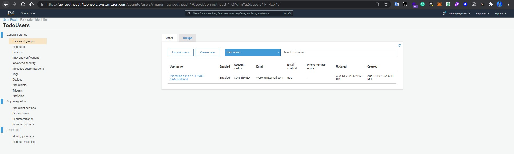

## Tổng quan

Kiến trúc một ứng dụng quản lý công việc sử dụng phi máy chủ (Serverless), trong đó có các tính năng như người dùng đã đăng ký có thể tạo đầu việc, cập nhật, xem các mục hiện có và cuối cùng là xóa chúng.

Đây là kiến ​​trúc thường được sử dụng khi triển khai ứng dụng web trên AWS. Sử dụng dịch vụ serverless để giảm độ phức tạp trong quy trình vận hành và tối ưu hóa chi phí cho các ứng dụng cần tốc độ triển khai nhanh để tiếp cận người dùng cuối.

* Backend: [AWS Lambda](https://aws.amazon.com/lambda), [Amazon API Gateway](https://aws.amazon.com/apigateway) để xử lý nghiệp vụ.
* Database: [Amazon DynamoDB](https://aws.amazon.com/dynamodb)
* Authentication: [Amazon Cognito](https://aws.amazon.com/cognito) quản lý và xác thực người dùng
* Frontend Hosting: [AWS Amplify Console](https://aws.amazon.com/amplify/console) CI/CD cho frontend

## Sơ đồ kiến trúc

## Các tài nguyên cần thiết

* TodoUserPool - Cognito UserPool lưu trữ tất cả người dùng ứng dụng

* TodoUserPoolTokenClient - Cognito UserPool Client được sử dụng bởi ứng dụng web

* TodoDomain - Tên miền Cognito UserPool

* TodoTable - DynamoDB được sử dụng để chứa tất cả các mục việc cần làm cho tất cả người dùng

* TodoApi - API Gateway (REST API) được sử dụng để hiển thị chức năng ứng dụng quản lý công việc

* GetTodoFunction - Lambda function được sử dụng để truy xuất một mục việc cần làm

* GetAllTodoFunction - Lambda function được sử dụng để lấy tất cả các mục việc cần làm

* CompleteTodoFunction - Lambda function được sử dụng để đặt trạng thái của một mục là hoàn thành

* AddTodoFunction - Lambda function được sử dụng để tạo một mục công việc mới

* UpdateTodoFunction - Lambda function được sử dụng để cập nhật nội dung của một mục việc cần làm

* DeleteTodoFunction - Lambda function được sử dụng để xóa một mục việc cần làm

* ApiGatewayPushToCloudWatchRole - IAM role để cấp quyền cho API Gateway gửi nhật ký (log) tới CloudWatch Logs

* ApiAccessLogGroup - CloudWatch Logs Log Group được API Gateway sử dụng cho các thông báo nhật ký (log) của nó

* AmplifyApp - Amplify Console application sẽ quản lý việc triển khai các bản cập nhật giao diện người dùng dựa trên các lần push lên GitHub

* AmplifyBranch - Kết nối nhánh GitHub với ứng dụng Amplify Console

* AmplifyRole - IAM role cho phép Amplify Console để thực hiện các hành động xây dựng và triển khai

## Kết quả triển khai

Giao diện

Cognito User Pool

Cognito User Client

DynamoDB

Lambda

API Gateway

## Chi phí ước tính

Sử dụng công cụ tính giá [AWS Pricing Calculator](https://calculator.aws/) để ước tính chi phí.

(*) Áp dụng cho Region Singapore (ap-southeast-1)

Ví dụ:
Số lượng người dùng đồng thời (CCU): 500
Nếu trung bình mỗi giây họ gọi 1 request và sử dụng 8 tiếng 1 ngày.
* Số lượng yêu cầu mỗi giây (RPS): 500 request/second
* Yêu cầu mỗi tháng (RPM): 60 * 8 * 30 * 500 = 7.200.000 request/month

Chi phí bao gồm:
* API Gateway REST API cost: 30.60 USD
* Lambda costs - Without Free Tier: 4.44 USD
* DynamoDB (DynamoDB on-demand capacity):
    * Monthly read cost (7.200.000 request): 1.03 USD
    * Monthly write cost (7.200.000 request): 10.25 USD
* CloudWatch Standard Logs: Data Ingested (10 GB): 7.05 USD

Tổng cộng (monthly): 53.65 USD

(*) Chưa tính phí dịch vụ của Route53, Cognito và Amplify.

https://calculator.aws/#/estimate?id=0e458f90df4ecbe033acf07f65750f67765af089

## Kết luận

Nhờ tận dụng được các dịch vụ sẵn có của AWS, ứng dụng có thể được triển khai nhanh chóng, developer có thể tập trung phát triển logic để tạo ra sự khác biệt cho khách hàng mà không cần phải bận tâm quá nhiều tới hạ tầng.

Tính khả dụng cao, dễ dàng mở rộng quy mô của ứng dụng trong thời gian ngắn và không tốn nhiều công sức.

Tuy nhiên với kiến trúc web app bằng Serverless vẫn tồn tại vài điểm yếu như độ trễ cao (trung bình xấp xỉ 200ms cho mỗi request). Thời gian khởi động từ trạng thái lạnh (cold start) vẫn ở mức cao (vài giây) sẽ gây ra chút ít khó chịu cho người dùng ở những lần truy cập đầu tiên.